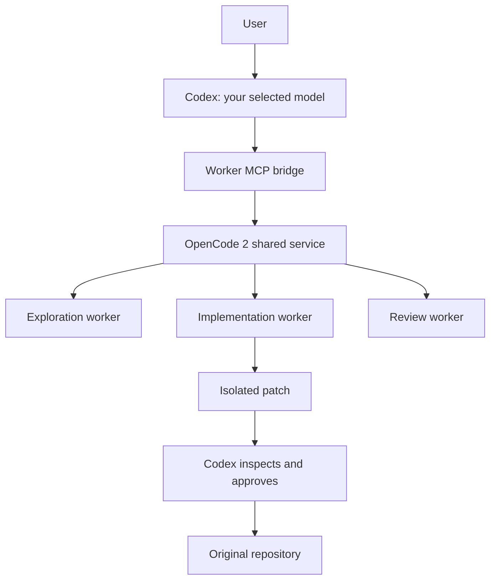

# Codex → OpenCode 2 worker bridge

[](https://github.com/aashahin/codex-opencode-orchestrator/actions/workflows/ci.yml)

An MCP server that lets Codex delegate bounded tasks to multiple models through
one persistent OpenCode 2 service. Codex owns planning, review, integration, and
final verification. Workers get independent sessions and isolated Git worktrees.



Use normal `codex` with your existing authentication and any model supported by
your provider. This bridge adds worker tools; it does not change your default
Codex model or provider. `codex2`, where mentioned below, is an optional local
alias for a second Codex configuration home, not a separate Codex distribution.

The implementation uses Bun, TypeScript, the official `@opencode-ai/client` V2
network client, and the MCP SDK. It connects to the shared service rather than
starting a runtime per task. OpenCode V1 and its SDK are not used.

## Install

The reference platform is Linux with Bun 1.4.2, Git, and Codex CLI on `PATH`.
The pinned client is `0.0.0-beta-19271`; live validation used OpenCode 2 service
`0.0.0-beta-19289`. OpenCode 2 is beta software: verify compatibility before
upgrading its service or client.

Install OpenCode 2 if it is not already available:

```sh
bun install -g --trust @opencode-ai/cli@0.0.0-beta-19289
opencode2 --version
opencode2 service start
opencode2 api get /api/health
```

OpenCode 2 installs as `opencode2` and can coexist with an existing `opencode` V1
installation. Connect worker providers using `opencode2 auth login`.

Clone this repository into a stable location and install the bridge:

```sh
git clone https://github.com/aashahin/codex-opencode-orchestrator.git
cd codex-opencode-orchestrator
bun install --frozen-lockfile
bun test
bun run typecheck
bun run install-local
codex mcp get opencode_workers
```

The installer records absolute paths to Bun and this checkout, so keep the
checkout in place. It merges only `mcp_servers.opencode_workers` into the selected
Codex home and `~/.codex/config.toml`. It backs up changed configs and preserves
existing authentication, providers, profiles, and unrelated settings. Repeated
installation is idempotent. It also creates `codex-orchestrator-doctor` and two
optional Zen shortcuts under `~/.local/bin`; add that directory to `PATH` if needed.
Shell startup files are not edited by the installer.

To register an additional Codex home:

```sh
CODEX_HOME="$HOME/.codex2" bun run install-local
```

Launch it with `CODEX_HOME="$HOME/.codex2" codex`, or define a `codex2` alias in
your shell. Restart Codex after installation so it loads the new MCP tools.

## Optional Zen shortcuts

`codex-astra` and `codex-sol` select the `opencode_zen` provider and request
`gpt-6-astra` and `gpt-5.6-sol`, respectively. Their availability depends on your
Zen account. They supply the complete provider definition through CLI overrides,
so neither requires a global provider block in a Codex configuration file.

These shortcuts read `OPENCODE_ZEN_API_KEY` from the environment. Supply it through
your local credential management or a private shell configuration outside the
repository. The installer does not store keys. OpenCode Go credentials are not
substituted for a Zen key. Normal Codex authentication remains separate from worker
provider authentication.

## Daily workflow

In an initialized Git repository, run `codex` and give it this instruction:

> Implement the requested feature. Delegate repository exploration and independent
> review to OpenCode workers. Use isolated workers for implementation. Review all
> worker patches before applying them. Run final tests yourself.

Copy or merge `templates/AGENTS.orchestration.md` into a project's instructions if
wanted. Installation never modifies a project's `AGENTS.md`.

## MCP tools

| Tool | Purpose |
| --- | --- |
| `oc_health` | V2 service/version, Go connection, latest live probe, model routing, bridge status |
| `oc_models` | Current enabled V2 models, capabilities, role mappings |
| `oc_delegate` | One bounded task, source snapshot and independent V2 session |
| `oc_delegate_parallel` | Independent concurrent tasks; per-task failures and timeouts |
| `oc_worker_diff` | Paginated patch; complete inspection yields a `reviewToken` |
| `oc_apply_worker_patch` | Explicit application after identity, HEAD, content/index and Git checks |
| `oc_discard_worker` | Collect changes and clean resources; preserves unapplied patches by default |
| `oc_cancel_worker` | Interrupt execution without destroying work |
| `oc_list_workers` | Pending/retained worker IDs, sessions' repository/worktree paths and status |

`oc_delegate` accepts `task`, absolute Git-root `repoDir`, `role`, optional `model`,
`mode`, `scope`, `constraints`, `verification`, and `timeoutSeconds`. Default mode is
`read_only`. Use `write_isolated` for implementers; explorer/reviewer writes are
rejected. Scope entries are relative file/directory names or simple `*`/`?` patterns.
Default concurrency is 3, configurable up to 8 per bridge process. A parallel call
accepts at most 16 tasks. Default timeout is 300 seconds, maximum 1800 per worker.
MCP request cancellation interrupts workers; closing Codex also interrupts its
active workers. The shared OpenCode 2 service remains running.

For review of an implementation, pass its returned `worktree` as the reviewer
`repoDir`. Discard that reviewer before discarding the worktree it reviewed.

## Routing and configuration

Default routing preferences (availability is discovered through V2 at runtime):

| Role | Model |
| --- | --- |
| explorer | `opencode-go/deepseek-v4-flash` |
| implementer | `opencode-go/kimi-k2.7-code` |
| reviewer | `opencode-go/qwen3.8-max` |
| hard_reasoning | `opencode-go/grok-4.6` |
| vision | `opencode-go/deepseek-v4-flash-vision-exp` |
| cheap | `opencode-go/deepseek-v4-flash` |

Edit `~/.config/codex-opencode-orchestrator/config.json` and restart the Codex
session to change preferences, concurrency, timeout or size bounds. Example:

```json
{
  "routing": {
    "explorer": ["opencode/mimo-v2.5-free"],
    "implementer": ["opencode-go/kimi-k2.7-code", "opencode-go/kimi-k3"]
  },
  "parallelism": 3,
  "timeoutSeconds": 300
}
```

Missing preferences fall back to enabled models with suitable capabilities and
role/cost heuristics. An explicitly requested unavailable model is rejected.
Catalog presence cannot prove remaining credits: billing errors are returned
clearly, with no silent switch away from an explicitly requested model. Override
`model` or routing to select another enabled model when appropriate. Free-model
availability can change; inspect `oc_models` before selecting one.
`OC_BRIDGE_CONFIG` selects an alternate bridge configuration file.

## Isolation and safety

Every worker gets a detached worktree, including readers. Source snapshots include
tracked staged/unstaged edits and non-ignored untracked files. Plumbing commands
use a private index and raw blob hashing, with hooks, filesystem monitors, external
diffs and text conversion excluded from snapshot/diff operations. Binary data,
executable bits, deletions and unusual filenames are supported. Internal snapshot
commits never move the user's branch or change its index. Git can eventually prune
unreferenced snapshot objects using its normal retention policy.

Worker deltas exclude the original dirty state and temporary worker configuration.
Worker-created ignored files are also collected, so cleanup cannot silently lose them.
Original OpenCode project configuration is held outside the worker Location and
restored before diff collection. V2-only policies and unique primary agents exist
only inside temporary worktrees; global OpenCode/V1 configuration is not rewritten.
Only selected built-in V2 plugins are enabled for workers.

Policies deny shell commands, subagents, global configuration, sensitive file reads,
external access, and unknown actions. File edits are allowed only for isolated
implementers within scope; `.git` and OpenCode configuration are protected. This is
an intentional safe shell policy: V2 shell is not an OS sandbox. Tests are listed
for the principal orchestrator to run; worker claims are explicitly unverified.

Patch application requires complete diff inspection and its digest token. Changed
HEAD, changed target content or index entries, symlink parents and wrong repositories
are refused. Other user files and the staging area remain intact. Application never
commits, pushes or uses reset/checkout to discard changes. Bridge operations use
filesystem locks; avoid simultaneous external edits to target files during apply.

The V2 session API currently has no schema-constrained final-result parameter.
The fallback requests one JSON object, validates it with Zod, and labels invalid
responses as unverified prose. File changes and patch safety never depend on prose.

Safety boundaries: supply an initialized non-bare Git root with a valid HEAD and
resolved index. Gitlinks/submodule parent snapshots are refused; delegate to a
submodule's own repository root separately. Ignored build/dependency directories
are not copied. OpenCode configuration files cannot be implementation targets.
Snapshots default to 256 MiB total / 30,000 files, patches to 16 MiB, and subprocess
output to 32 MiB. Oversized or unsupported snapshots fail before model execution.

## Service, state and recovery

Discovery uses the official `@opencode-ai/client/service` API and XDG registration,
not a fixed port. The bridge calls `opencode2 service start` only when discovery
finds no healthy service. Clients and the background service are reused; each unit
gets its own session. Registration is rediscovered on operations, including after
a service restart. No separate bridge daemon is installed.

`OPENCODE_SERVER_URL` may select an existing loopback HTTP V2 service. Remote
services are refused because local worktree paths/permissions cannot be guaranteed
there. Automatic discovery also handles native service authentication without
logging or copying the password.

State: `~/.local/state/codex-opencode-orchestrator/`; worktrees:
`~/.cache/codex-opencode-orchestrator/worktrees/`. XDG overrides are respected.
Metadata/patches are private to the user. No automatic TTL deletes uncollected work.
Use `oc_list_workers` and `oc_discard_worker`; pass `discardPatch: true` only after
explicitly deciding to discard its unapplied patch. If stopping a session cannot be
confirmed, its worktree is quarantined and preserved. Discard retries interruption
and patch collection. Interrupted bridge processes retain IDs for recovery.

## Troubleshooting

- **V2 not connected:** `opencode2 service status`, `opencode2 service start`, then
  `opencode2 api get /api/health`. V1 success is not a V2 health result.
- **Go authentication/billing:** doctor distinguishes a V2 connection from the last
  live result. `opencode2 auth login` is the official connection flow. Resolve the
  account balance or choose an enabled free model. Do not copy credentials by hand.
- **Missing model:** call `oc_models`; adjust routing or remove an invalid explicit
  override. Discovery waits for V2 provider activation before reading the catalog.
- **Zen key missing:** this affects only the optional `codex-astra`/`codex-sol`
  shortcuts. Use normal `codex`/`codex2` with existing authentication, or set
  `OPENCODE_ZEN_API_KEY` if you specifically want the Zen orchestrator provider.
- **MCP missing:** `codex mcp get opencode_workers`; from the install directory run
  `bun install --frozen-lockfile` and `bun run install-local`. Restart Codex afterward.
- **Worktree/snapshot conflict:** stop concurrent source changes and delegate again.
  Resolve an unmerged index first; supply the exact repository root.
- **Patch conflict:** inspect current user changes and redelegate from current source.
  Never reset the original repository to force a worker patch through.
- **Stale work:** use `oc_list_workers`, then conservative discard. Locks under
  `state/locks/` include the owner PID/time. If a bridge crashed while holding a
  lock, verify that owner is no longer running before removing that specific lock.

## Verification

```sh
bun test
bun run typecheck
```

The 25 automated tests cover real Git fixtures, dirty snapshots, patch conflicts,
permission policy, installer preservation, launcher arguments, cancellation,
concurrency, and the MCP protocol. They use controlled worker responses and do not
require API keys or a running OpenCode service. GitHub Actions runs these tests
and TypeScript checking on each push and pull request.

Optional live checks require an OpenCode 2 service and suitable provider access:

```sh
bun run smoke                 # Uses opencode/mimo-v2.5-free when available
bun scripts/paid-smoke.ts      # Uses provider credits and optional Zen shortcuts
bun scripts/recovery-smoke.ts  # Restarts the shared service; refuses active sessions
```

Live checks produce local `LIVE-TESTS.json`, `PAID-TESTS.json`, and
`RECOVERY-TESTS.json` reports. These contain machine/runtime details and are ignored
by Git. Live validation before publication exercised the free-model workflow,
V2 permission decisions, concurrent sessions, and service restart recovery.
Account-specific credentials, billing results, and session reports are not included
in this repository. A discovered model does not guarantee authenticated or funded
access.

Official references: [Zen endpoints](https://opencode.ai/docs/zen/),
[V2 permissions](https://opencode.ai/v2/docs/permissions),
[V2 agents](https://opencode.ai/v2/docs/agents),
[V2 configuration](https://opencode.ai/v2/docs/config). API signatures were verified
against the installed official beta-19271 client and schema packages.
