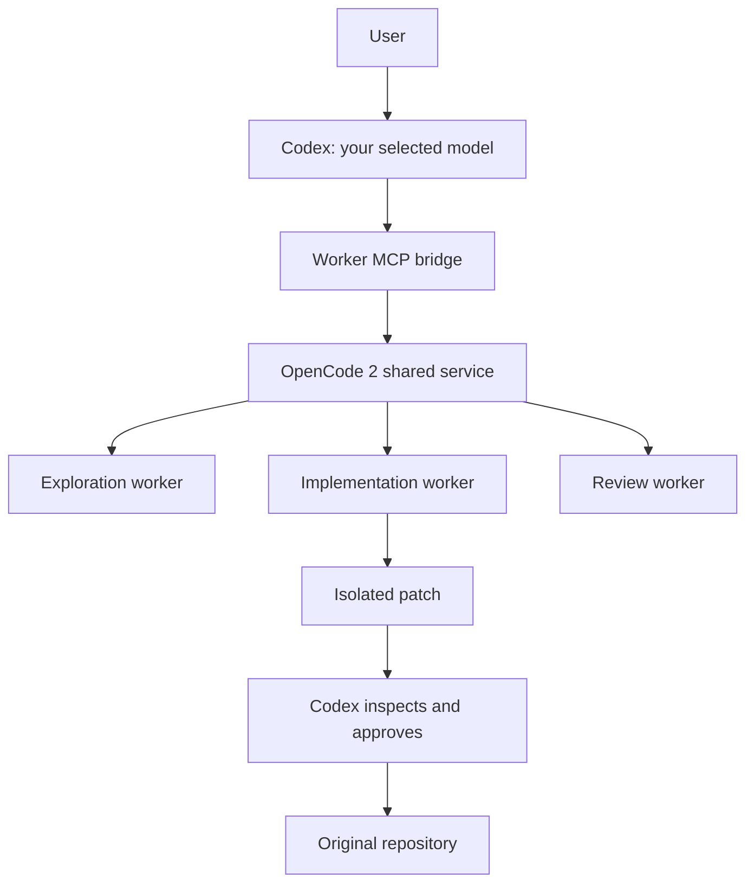

# Codex → OpenCode 2 worker bridge

[](https://github.com/aashahin/codex-opencode-orchestrator/actions/workflows/ci.yml)

An MCP server that lets Codex delegate bounded tasks to multiple models through
one persistent OpenCode 2 service. Codex owns planning, review, integration, and
final verification. Workers get independent sessions and isolated Git worktrees.



Use normal `codex` with your existing authentication and any model supported by
your provider. This bridge adds worker tools; it does not change your default
Codex model or provider. `codex2`, where mentioned below, is an optional local
alias for a second Codex configuration home, not a separate Codex distribution.

The implementation uses Bun, TypeScript, the official `@opencode/client` V2
network client, and the MCP SDK. It connects to the shared service rather than
starting a runtime per task. OpenCode V1 and its SDK are not used.

## Install

The reference platform is Linux with Bun 1.4.2, Git, and Codex CLI on `PATH`.
The bridge supports stable **OpenCode 2.0.0 and later** by detecting the service's
API capabilities, with no patch-version allowlist or major-version ceiling.
Compatibility is verified against real 2.0.3 and 2.0.5 services and the latest
release in CI. New versions using a supported API shape connect automatically;
a new incompatible API needs an adapter, rather than a version-check workaround.
Prereleases remain excluded.

The current official client is `@opencode/client@2.0.5`. A second official stable
client, 2.0.3, is installed as `@opencode/client-legacy` for the earlier API shape.
Neither is a beta package. Client dependencies remain locked for reproducible
installs; the detected service protocol selects the adapter at runtime.

Install OpenCode 2 if it is not already available:

```sh
bun install -g --trust @opencode/cli@latest
opencode --version
opencode service start
opencode api get /api/status
```

Stable OpenCode installs as `opencode`; this replaces the old V1 command on PATH.
The bridge prefers `opencode` and accepts an existing `opencode2` alias as a
fallback. It does not use the V1 runtime. Connect providers with `opencode auth login`.
See the [official stable installation instructions](https://opencode.ai/v2/docs).

Clone this repository into a stable location and install the bridge:

```sh
git clone https://github.com/aashahin/codex-opencode-orchestrator.git
cd codex-opencode-orchestrator
bun install --frozen-lockfile
bun test
bun run typecheck
bun run install-local
codex mcp get opencode_workers
```

The installer records absolute paths to Bun and this checkout, so keep the
checkout in place. It merges only `mcp_servers.opencode_workers` into the selected
Codex home and `~/.codex/config.toml`. It backs up changed configs and preserves
existing authentication, providers, profiles, and unrelated settings. It also
merges a marked OpenCode delegation/recovery section into the active global
`AGENTS.md` (or non-empty `AGENTS.override.md`) in each selected Codex home,
preserving existing instructions outside that section. Changed instruction files
are backed up. Repeated installation is idempotent.
It also creates `codex-orchestrator-doctor` and two
optional Zen shortcuts under `~/.local/bin`; add that directory to `PATH` if needed.
Shell startup files are not edited by the installer.

To register an additional Codex home:

```sh
CODEX_HOME="$HOME/.codex2" bun run install-local
```

Launch it with `CODEX_HOME="$HOME/.codex2" codex`, or define a `codex2` alias in
your shell. Restart Codex after installation so it loads the new MCP tools.

## Optional Zen shortcuts

`codex-astra` and `codex-sol` select the `opencode_zen` provider and request
`gpt-6-astra` and `gpt-5.6-sol`, respectively. Their availability depends on your
Zen account. They supply the complete provider definition through CLI overrides,
so neither requires a global provider block in a Codex configuration file.

These shortcuts read `OPENCODE_ZEN_API_KEY` from the environment. Supply it through
your local credential management or a private shell configuration outside the
repository. The installer does not store keys. OpenCode Go credentials are not
substituted for a Zen key. Normal Codex authentication remains separate from worker
provider authentication.

## Daily workflow

In an initialized Git repository, run `codex` and give it this instruction:

> Implement the requested feature. Delegate repository exploration and independent
> review to OpenCode workers. Use isolated workers for implementation. Review all
> worker patches before applying them. Run final tests yourself.

Copy or merge `templates/AGENTS.orchestration.md` into a project's instructions if
wanted. Installation updates global Codex guidance, not a project's `AGENTS.md`.

## Compaction, follow-up work, and failures

OpenCode work stays on `oc_delegate` / `oc_delegate_parallel`, including review
corrections. Do not recover workers with `opencode2 run --standalone --session`,
`opencode run`, or direct API/client scripts. Those paths bypass bridge state,
permissions, patch review, and the shared-service workflow.

The installer adds persistent global guidance, and the MCP server supplies the
same workflow during initialization. Tool descriptions and failure responses also
carry the recovery rule so it is available when conversation details are compacted.
After compaction, call `oc_health` and `oc_list_workers`; match the original
repository and bridge worker UUID, not a raw OpenCode `ses_` ID. Confirm old work
has stopped before replacing it. Inspect preserved patches, apply acceptable
changes with `oc_apply_worker_patch`, then delegate the remaining task against the
original repository. Unaccepted patches stay available for review.

Summaries should retain the MCP transport requirement, original `repoDir`, worker
UUIDs, selected model and variant/reasoning effort, ownership scope, patch status, and next MCP action. If tools
are unavailable, reconnect or repair the bridge; an error does not authorize a
different transport. These are agent instructions, not an OS-level ban on CLI
execution. Restart Codex after updating so it loads the new global guidance and
MCP metadata. Codex discovers global guidance once per launched session; see the
[official instruction-loading documentation](https://learn.chatgpt.com/docs/agent-configuration/agents-md).


## MCP tools

| Tool | Purpose |
| --- | --- |
| `oc_health` | V2 service/version, Go connection, latest live probe, model routing, bridge status |
| `oc_models` | Current enabled models, variants, reasoning efforts, capabilities, role mappings |
| `oc_delegate` | One bounded task, source snapshot and independent V2 session |
| `oc_delegate_parallel` | Independent concurrent tasks; per-task failures and timeouts |
| `oc_worker_diff` | Paginated patch; complete inspection yields a `reviewToken` |
| `oc_apply_worker_patch` | Explicit application after identity, HEAD, content/index and Git checks |
| `oc_discard_worker` | Collect changes and clean resources; preserves unapplied patches by default |
| `oc_cancel_worker` | Interrupt execution without destroying work |
| `oc_list_workers` | Pending/retained worker IDs, sessions' repository/worktree paths and status |

`oc_delegate` accepts `task`, absolute Git-root `repoDir`, `role`, optional `model`,
`variant`, `reasoningEffort`, `mode`, `scope`, `constraints`, `verification`, and
`timeoutSeconds`. Default mode is
`read_only`. Use `write_isolated` for implementers; explorer/reviewer writes are
rejected. Scope entries are relative file/directory names or simple `*`/`?` patterns.
Default concurrency is 3, configurable up to 8 per bridge process. A parallel call
accepts at most 16 tasks. Default timeout is 300 seconds, maximum 1800 per worker.
MCP request cancellation interrupts workers; closing Codex also interrupts its
active workers. The shared OpenCode 2 service remains running.

For review of an implementation, pass its returned `worktree` as the reviewer
`repoDir`. Discard that reviewer before discarding the worktree it reviewed.

## Model variants and reasoning effort

Call `oc_models` first. Each model exposes `variants`, with an `id` and an optional
`reasoningEffort`; the existing `reasoningVariants` list is retained for clients
that already consume it. Variant names and settings are model-specific, including
variants that configure a token budget without advertising a reasoning effort.

For a model advertising `xhigh`, call `oc_delegate` with:

```json
{
  "repoDir": "/absolute/path/to/repository",
  "task": "Review the retry logic and report concrete failure cases.",
  "role": "reviewer",
  "model": "opencode-go/muse-spark-1.3-contributor",
  "variant": "xhigh"
}
```

The same fields work on every task in `oc_delegate_parallel`. Use the base
`provider/model` in `model` and the exact catalog ID in `variant`, rather than
appending `#xhigh` to the model string. Models and access can change; the example
requires that exact model and variant to be available to your account.

Existing `reasoningEffort: "xhigh"` requests remain supported. Effort selection
prefers the matching named variant, or a single variant advertising that effort.
If several variants match, select one explicitly. When both fields are supplied,
the variant must advertise that effort. Unknown variants, missing efforts, and
conflicting requests fail before a worker session starts. There is no silent
model switch or effort downgrade. Omitting both fields leaves the provider default.

The bridge passes the selection to the official session API and verifies it on
session creation, completion, and every retrieved assistant message. Results and
`oc_list_workers` retain `requestedVariant`, `requestedReasoningEffort`,
`selectedModel`, and `effectiveModel` (when completed), including after reconnecting.
These checks verify OpenCode's reported selection; they cannot measure a provider's
internal reasoning. See [OpenCode model variants](https://opencode.ai/v2/docs/models#variants).

## Upgrading from the beta bridge

Stable packages use the `@opencode/*` scope. `@opencode-ai/cli` and
`@opencode-ai/client` are the old packages; updating their tags does not migrate
them to the stable distribution. Install the stable CLI above, then update the
bridge from its registered checkout:

```sh
git pull --ff-only
bun install --frozen-lockfile
bun test
bun run typecheck
bun run install-local
# If you also use a second Codex home:
CODEX_HOME="$HOME/.codex2" bun run install-local
```

Remove the old CLI package from the package manager that installed it, for example
`bun remove -g @opencode-ai/cli`. Verify `opencode --version` and the service health
separately: an existing service may still be running the old binary. Finish or
cancel active work through MCP before restarting that service. Preserve unapplied
patches. Restart Codex to load the new bridge code and tool schemas; changing files
does not replace a bridge process already loaded in another Codex session.

The `opencode2` key in `oc_health` remains for response compatibility and reports
the stable service. No prerelease client or runtime is needed.

### Upgrade compatibility

OpenCode 2.0.5 changed the API despite being a patch release: it replaced
`/api/health` with `/api/status`, removed plugin `await-activation`, and moved
session waiting to `/api/experimental/session/:id/wait`. The bridge probes
`/api/status` first, then `/api/health` only on HTTP 404, and uses the matching
official client. It waits for required plugins to report active before reading
models or verifying a worker agent; an initially empty catalog is not readiness.

Authentication failures, malformed responses, missing capabilities, and PID
mismatches do not trigger a service restart or transport fallback. Existing
sessions and unapplied patches are preserved. Errors identify the failed probe
or plugin. This cannot make an arbitrary future breaking API compatible, but it
avoids requiring a bridge edit for every new version number.

After installing this bridge update, restart Codex once to load the adapters.
Later compatible OpenCode upgrades are detected by that running bridge without
reinstalling it. Finish active worker tasks before intentionally restarting the
OpenCode service itself.

## Routing and configuration

Default routing preferences (availability is discovered through V2 at runtime):

| Role | Model |
| --- | --- |
| explorer | `opencode-go/deepseek-v4-flash` |
| implementer | `opencode-go/kimi-k2.7-code` |
| reviewer | `opencode-go/qwen3.8-max` |
| hard_reasoning | `opencode-go/grok-4.6` |
| vision | `opencode-go/deepseek-v4-flash-vision-exp` |
| cheap | `opencode-go/deepseek-v4-flash` |

Edit `~/.config/codex-opencode-orchestrator/config.json` and restart the Codex
session to change preferences, concurrency, timeout or size bounds. Example:

```json
{
  "routing": {
    "explorer": ["opencode/mimo-v2.5-free"],
    "implementer": ["opencode-go/kimi-k2.7-code", "opencode-go/kimi-k3"]
  },
  "parallelism": 3,
  "timeoutSeconds": 300
}
```

Missing preferences fall back to enabled models with suitable capabilities and
role/cost heuristics. An explicitly requested unavailable model is rejected.
Catalog presence cannot prove remaining credits: billing errors are returned
clearly, with no silent switch away from an explicitly requested model. Override
`model` or routing to select another enabled model when appropriate. Free-model
availability can change; inspect `oc_models` before selecting one.
`OC_BRIDGE_CONFIG` selects an alternate bridge configuration file.

## Isolation and safety

Every worker gets a detached worktree, including readers. Source snapshots include
tracked staged/unstaged edits and non-ignored untracked files. Plumbing commands
use a private index and raw blob hashing, with hooks, filesystem monitors, external
diffs and text conversion excluded from snapshot/diff operations. Binary data,
executable bits, deletions and unusual filenames are supported. Internal snapshot
commits never move the user's branch or change its index. Git can eventually prune
unreferenced snapshot objects using its normal retention policy.

Worker deltas exclude the original dirty state and temporary worker configuration.
Worker-created ignored files are also collected, so cleanup cannot silently lose them.
Original OpenCode project configuration is held outside the worker Location and
restored before diff collection. V2-only policies and unique primary agents exist
only inside temporary worktrees; global OpenCode/V1 configuration is not rewritten.
Only selected built-in V2 plugins are enabled for workers.

Policies deny shell commands, subagents, global configuration, sensitive file reads,
external access, and unknown actions. File edits are allowed only for isolated
implementers within scope; `.git` and OpenCode configuration are protected. This is
an intentional safe shell policy: V2 shell is not an OS sandbox. Tests are listed
for the principal orchestrator to run; worker claims are explicitly unverified.

Workers are bounded by bridge timeouts and cancellation, not a V2 `steps` cap.
V2 forces a text-only final request at that cap; providers that accept only
`tool_choice=auto` can reject it. An earlier 24-step cap caused this failure on
long Muse tasks. See [OpenCode's step-limit behavior](https://opencode.ai/v2/docs/agents#steps).


Patch application requires complete diff inspection and its digest token. Changed
HEAD, changed target content or index entries, symlink parents and wrong repositories
are refused. Other user files and the staging area remain intact. Application never
commits, pushes or uses reset/checkout to discard changes. Bridge operations use
filesystem locks; avoid simultaneous external edits to target files during apply.

The V2 session API currently has no schema-constrained final-result parameter.
The fallback requests one JSON object, validates it with Zod, and labels invalid
responses as unverified prose. File changes and patch safety never depend on prose.

Safety boundaries: supply an initialized non-bare Git root with a valid HEAD and
resolved index. Gitlinks/submodule parent snapshots are refused; delegate to a
submodule's own repository root separately. Ignored build/dependency directories
are not copied. OpenCode configuration files cannot be implementation targets.
Snapshots default to 256 MiB total / 30,000 files, patches to 16 MiB, and subprocess
output to 32 MiB. Oversized or unsupported snapshots fail before model execution.

## Service, state and recovery

Discovery reads the official XDG service registration contract and probes the
registered loopback endpoint with its native authentication, not a fixed port.
The bridge calls `opencode service start` only when registration is absent or
the registered process is confirmed gone. Clients and the background service are
reused; each unit gets its own session. Registration and protocol are rediscovered
on operations, including after a service upgrade or restart. The cached client
changes when the endpoint, authentication, PID, version, or API shape changes.
No separate bridge daemon is installed.

`OPENCODE_SERVER_URL` may select an existing loopback HTTP V2 service. Remote
services are refused because local worktree paths/permissions cannot be guaranteed
there. Automatic discovery also handles native service authentication without
logging or copying the password.

State: `~/.local/state/codex-opencode-orchestrator/`; worktrees:
`~/.cache/codex-opencode-orchestrator/worktrees/`. XDG overrides are respected.
Metadata/patches are private to the user. No automatic TTL deletes uncollected work.
Use `oc_list_workers` and `oc_discard_worker`; pass `discardPatch: true` only after
explicitly deciding to discard its unapplied patch. If stopping a session cannot be
confirmed, its worktree is quarantined and preserved. Discard retries interruption
and patch collection. Interrupted bridge processes retain IDs for recovery.

## Troubleshooting

- **V2 not connected:** `opencode service status`, then
  `opencode api get /api/status` (use `/api/health` on 2.0.3). Start the service if absent. Do not restart while
  other sessions are active.
- **API mismatch after upgrade:** use `oc_health`; its `opencode2.protocol` identifies
  the selected adapter. If it still reports bridge 1.1.0 or older, restart Codex to
  load the installed update. A healthy service with no compatible API is reported
  explicitly; do not downgrade or bypass MCP merely to suppress the error.
- **Go authentication/billing:** doctor distinguishes a V2 connection from the last
  live result. `opencode auth login` is the official connection flow. Resolve the
  account balance or choose an enabled free model. Do not copy credentials by hand.
- **Missing model:** call `oc_models`; adjust routing or remove an invalid explicit
  override. Discovery waits for V2 provider activation before reading the catalog.
- **Zen key missing:** this affects only the optional `codex-astra`/`codex-sol`
  shortcuts. Use normal `codex`/`codex2` with existing authentication, or set
  `OPENCODE_ZEN_API_KEY` if you specifically want the Zen orchestrator provider.
- **MCP missing:** `codex mcp get opencode_workers`; from the install directory run
  `bun install --frozen-lockfile` and `bun run install-local`. Restart Codex afterward.
- **Worktree/snapshot conflict:** stop concurrent source changes and delegate again.
  Resolve an unmerged index first; supply the exact repository root.
- **Patch conflict:** inspect current user changes and redelegate from current source.
  Never reset the original repository to force a worker patch through.
- **Stale work:** use `oc_list_workers`, then conservative discard. Locks under
  `state/locks/` include the owner PID/time. If a bridge crashed while holding a
  lock, verify that owner is no longer running before removing that specific lock.

## Verification

```sh
bun test
bun run typecheck
bun scripts/compatibility-smoke.ts # Real runtime API checks; no model prompts
```

Automated tests cover real Git fixtures, dirty snapshots, patch conflicts,
permission policy, installer preservation, launcher arguments, cancellation,
concurrency, capability negotiation, both API generations, delayed plugin readiness,
upgrade reconnection, malformed/auth responses, exact model/variant selection,
session wait cancellation, persistent recovery instructions, and the MCP protocol. They use
controlled worker responses and do not
require API keys or a running OpenCode service. GitHub Actions runs these tests
and TypeScript checking on each push and pull request. A real-runtime matrix
tests 2.0.3, 2.0.5, and `latest`, including a daily scheduled check. Those checks
exercise catalog/agent readiness, variants, effective permissions, session
creation, waiting, interruption, and removal without sending model prompts or
requiring provider credits.

Optional live checks require an OpenCode 2 service and suitable provider access:

```sh
bun run smoke                 # Uses opencode/mimo-v2.5-free when available
bun scripts/stable-smoke.ts   # MCP xhigh/effort selection and reviewed patch integration
bun scripts/paid-smoke.ts      # Uses provider credits and optional Zen shortcuts
bun scripts/recovery-smoke.ts  # Restarts the shared service; refuses active sessions
bun scripts/tool-choice-smoke.ts # 26 sequential reads through MCP; uses Muse credits
```

Live checks produce local `LIVE-TESTS.json`, `PAID-TESTS.json`, and
`RECOVERY-TESTS.json` reports. These contain machine/runtime details and are ignored
by Git. Live validation before publication exercised the free-model workflow,
V2 permission decisions, concurrent sessions, and service restart recovery.
Account-specific credentials, billing results, and session reports are not included
in this repository. A discovered model does not guarantee authenticated or funded
access.

The tool-choice regression writes `TOOL-CHOICE-TESTS.json` locally and requires
more than 24 model steps. It defaults to `opencode-go/muse-spark-1.3-contributor`;
set `OC_SMOKE_MODEL` to explicitly test another enabled model. It is never run by
CI and does not change routing or provider credentials.

The stable smoke defaults to `opencode/muse-spark-1.3-contributor-free`, with
`xhigh` and `high` variants. Override `OC_SMOKE_MODEL`, `OC_SMOKE_VARIANT`, and
`OC_SMOKE_EFFORT` for another model advertising both selections. It writes an
ignored `STABLE-TESTS.json` report and preserves unapplied patches on failure.
If the provider rejects the free tier, explicitly select an available funded
model with `OC_SMOKE_MODEL`; the script never silently changes models.

Validation on September 13, 2026 passed all 36 repository tests and TypeScript
checking. The live stable smoke verified concurrent `xhigh` and `high` workers,
preserved model selections, isolated editing, reviewed patch application, cleanup,
and reuse of the running 2.0.3 service. Model-execution checks are opt-in and are not run by CI.

The September 17 compatibility update passed 43 repository tests and TypeScript
checking. The live MCP smoke on 2.0.5 passed with Muse Go, including concurrent
`xhigh`/`high` tasks and reviewed patch application. The free model rejected access
with a provider-tier restriction; the separate Go run was selected explicitly.

Official references: [Zen endpoints](https://opencode.ai/docs/zen/),
[V2 permissions](https://opencode.ai/v2/docs/permissions),
[V2 agents](https://opencode.ai/v2/docs/agents),
[V2 configuration](https://opencode.ai/v2/docs/config). API signatures are checked against the official stable 2.0.3 and 2.0.5 clients.
